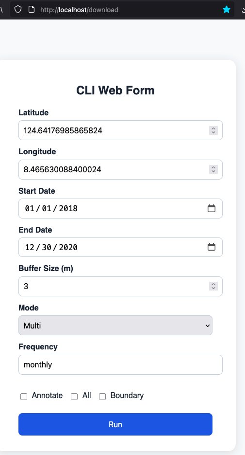

Download Sentinel-2A/2B images per month/quarter/year via Planetary Computer API (for Philippines only)
---
Created this simple downloader since I'm studying Remote Sensing and wanted to make downloading and clipping images faster.

Annotated images (not georeferenced, in PNG) of Payatas, Quezon City from 2015-2025


True color TIFs of Davao Bypass Road, Davao City from 2015-2025


## Usage
1. Clone repo
2. Build images - `docker compose build`
3. Start containers - `docker compose up --detach`
4. You should see 3 containers - `docker ps` like
```
IMAGE        ... PORTS                                        NAMES
eo-ph:latest ... 5001/tcp, 0.0.0.0:5555->5555/tcp             celery_worker
eo-ph:latest ... 0.0.0.0:80->80/tcp, 0.0.0.0:5001->5001/tcp   eo-ph
redis:latest ... 0.0.0.0:6379->6379/tcp                       redis
```
5. All logs are stored in `/logs`

### UI
Go to http://localhost/download and input the forms like below


### API
You can call it via the `api/download` POST endpoint with the sample payload and CURL call below
```
curl -X POST -H "Content-Type: application/json" --data @scratch/payload.json http://localhost/api/download
```

```
# payload.json
{
    "start_date": "2015-01-01",
    "end_date": "2021-12-30",
    "latitude": "8.465630088400024",
    "longitude": "124.64176985865824",
    "buffer": "3",
    "frequency": "yearly",
    "mode": "multi",
    "annotate": false,
    "boundary": false,
    "all": false,
    "workers": 9
}
```

### CLI
Not well documented but you can do `python -m eo --help` to see arguments.

## Outputs
All output images will go to `data/processed`

## Configuration
If **mode is single**, it will get the least cloudy image in the date range.

If **mode is multi**, it will get the least cloudy image per month/quarter/year (based on value of frequency).

If **annotate** is ticked/true, it will write details in the map and output is a simple PNG and not georeferenced.

If **boundary** is ticked/true, it will overlay the municipal/provincial boundaries.

If **all** is true, it will export the RGB, Red, Green, Blue TIFs.
